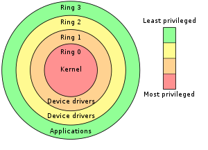
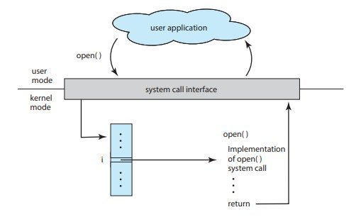

---

title: Meet-1 -> Intro to Kernel Exploitation
author: th3f0x
styles:
  style: gruvbox-dark
extensions:
  - image_ueberzug

---

## Overview

- [Overview](#overview)
- [Protection Rings](#protection-rings)
- [Task Struct](#task-struct)
- [Objectives](#objectives)
- [Challenge Files](#challenge-files)
- [Kernel Modules](#kernel-modules)
- [System Call](#system-call)
- [File Operations](#file-operations)
- [Challenges](#challenges)
- [Misc Tips](#misc-tips)
- [Links](#links)

---

## Protection Rings

*
*
* 

---

## Task Struct

```c
// [include/linux/sched.h]
struct task_struct {
    volatile long state;            // process state (running, stopped, ...)
    void *stack;                    // task's stack pointer
    int prio;                       // process priority
    struct mm_struct *mm;           // memory address space
    struct files_struct *files;     // open file information
    const struct cred *cred;        // credentials
  // ...
};
```

```c
struct cred {
    // .
    // .
    // .
    kuid_t  uid;        /* real UID of the task */
    kgid_t  gid;        /* real GID of the task */
    kuid_t  suid;       /* saved UID of the task */
    kgid_t  sgid;       /* saved GID of the task */
    kuid_t  euid;       /* effective UID of the task */
    kgid_t  egid;       /* effective GID of the task */
    // .
    // .
    // .
};
```

---

## Objectives

- The objective of successful exploitation is to gain a root shell and read the
file `/root/flag.txt` on the server.

- The priviledge escalation is achieved via changing `current_task->cred->euid` to 0. (Might need to change some other ids depending on situation.)

- Usually, the below code will do this for us.
  ```c
  commit_creds(prepare_kernel_cred(0));
  ```

---

## Challenge Files

### `start.sh` or `run.sh`

```sh
qemu-system-x86_64 \
    -m 64M \
    -enable-kvm \
    -nographic \ # use same terminal instead of new graphical window
    -kernel bzImage \ # which kernel file to use
    -append "console=ttyS0 init='/init' kaslr" \ # mostly some mitigations, also specifies init process (usually `/etc/init/rcS` by defualt on modern systems)
    -monitor /dev/null \
    -initrd init.cpio \ # where the initial file system is taken from, usually `initramfs.cpio.gz` or something like that
    -cpu kvm64,smep # cpu flags, usually look for things like `smep`, `smap` etc (mitigations)
```

### bzImage

- `https://en.wikipedia.org/wiki/Vmlinux#bzImage`
- Basically a compressed kernel image, for all we care
- To get actual kernel file (vmlinux), which can be used with gdb:
  ```sh
  extract-vmlinux bzImage > vmlinux
  ```
  - Extract vmlinux script can be found [here](https://raw.githubusercontent.com/torvalds/linux/master/scripts/extract-vmlinux)

  - This file is also usually present on our systems
  ```sh
  locate extract-vmlinux
  ```

### initramfs

- `https://wiki.ubuntu.com/Initramfs`
- For CTFs, this is the filesystem image. This is simply decompressed into a
  RAM based file system
- To recover (or decompress this archive):
```sh
# if file is given as `.gz`
gunzip -k initramfs.cpio.gz
mkdir initramfs
cd initramfs
cpio -iv < ../initramfs.cpio
```

- To recompress (after any modifications):
```sh
# if not already there
cd initramfs
find . | cpio -H newc -ov -F ../initramfs.cpio
gzip initramfs.cpio
```

- Most of the time, we need this for the kernel modules (`*.ko`) or to modify
  `init` file

---

## Kernel Modules

- Linux Kernel allows the addition of functionality at runtime, via `modules`
- Mostly, in CTFs, we have to attack such added code. These are usually some
  sort of devices (in `/dev`) or pseduo-files in `/proc`

```sh
lsmod # show currently loaded modules
modinfo name # show modules info
insmod name # install a module
rmmod name # remove a module
```

- If module is not installed(uncommon), install via `insmod`
- The code in these is accessed via `system-calls`

---

## System Call

*
*
* 

---

## File Operations

- To interact with the devices using `system-calls`, the kernel module
  registers functions to be used when the corresponding `system-calls` are made

```c
// [include/linux/fs.h]

struct file_operations {
    ssize_t (*read) (struct file *, char __user *, size_t, loff_t *);
    ssize_t (*write) (struct file *, const char __user *, size_t, loff_t *);
    int (*open) (struct inode *, struct file *);
    int (*release) (struct inode *, struct file *);
  // ...
};
```

```c
static int notes_open(struct inode *inode, struct file *file) {
    // Goes to kernel logs
    printk("Device opened\n");
    return SUCCESS;
}

static int notes_close(struct inode *inode, struct file * file) {
    // Goes to kernel logs
    printk("Device Closed\n");
    return SUCCESS;
}

// .
// .
// .

static struct file_operations notes_fops = {
    .owner = THIS_MODULE,
    .write = notes_write,
    .open = notes_open,
    .release = notes_close,
    .unlocked_ioctl = notes_ioctl,
};

// run at `insmod`
int init_module(void) {
    int Major;
    Major = register_chrdev(MAJOR_NUMBER,DEVICE_NAME,&notes_fops);
    if (Major < 0) {
        printk("Registering the character device failed with %d\n",
                Major);
        return Major;
    }
    return SUCCESS;
}

// run at `rmmod`
void cleanup_module(void) {
    unregister_chrdev(MAJOR_NUMBER,DEVICE_NAME);
}

```

- These correspond to function calls for things like `read`, `write`, `open`
  and `close` respectively.

```c
int main(void) {
    // device which gets created, either by module itself, or in the `init` file
    int fd = open("/dev/notes", O_RDWR);

    char payload1[0x38];
    memset(payload1, 'A', sizeof(payload1));

    *(void**)(payload1 + 0x30) = (void *)notes_fops_write1;

    write(fd, payload1, 0x30);
    write(fd, payload1, 0x30);
    // .
    // .
    // .
    close(fd);
}
```

- Thus interaction requires the ability to make raw low-level system-calls.
  Thus we usually use `C` for writing the exploits. One can also use `C++` or
  potentially `Rust`, but `C` is more common due to smaller binary sizes.

---

## Challenges

- Baby Kernel (from hack.lu CTF 2018)
  - Files: `baby_kernel_3460960b6fc99f8a90fba7397b5e4c46.zip`

- Baby Kernel 2 (from hack.lu CTF 2019)
  - Files: `baby_kernel_2_7787916f9b06d129da1aae2dc2b5f42a.zip`

---

## Misc Tips

- The addresses for functions like `commit_creds` and `prepare_kernel_cred` and
  pointer to the current task `current_task` can be found in `/proc/kallsyms`
  ```sh
  cat /proc/kallsyms | grep commit_creds # or anything else
  ```

- Current process's `task_struct` is referenced by pointer `current_task`.
```c
struct task_struct * current_task
```

---

## Home Assignment

- Try to read some portions from the [links](#links)
- Try both challenges yourself

---

## Links

- [Some core concepts](https://blog.lexfo.fr/cve-2017-11176-linux-kernel-exploitation-part1.html#core-concepts)
- [Kernel Challenges Basic Info](https://web.archive.org/web/20191019131252/http://www.auxy.xyz/modern%20binary%20exploitation/2019/06/10/Linux-Exp-Tutorial.html)

